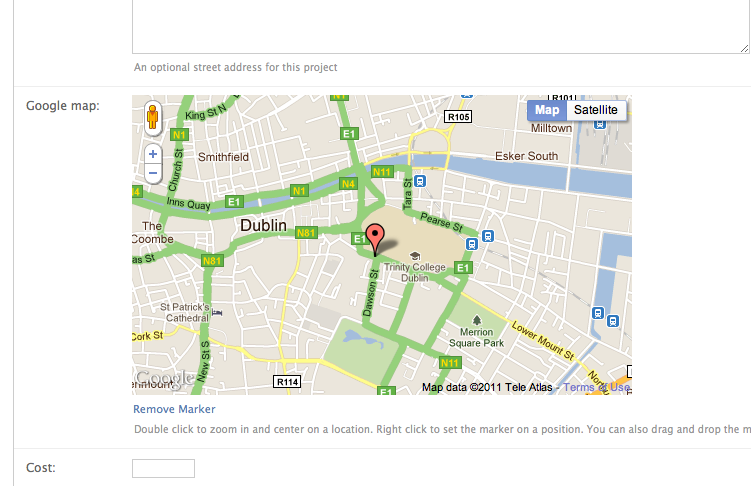

This fork uses the same modelfield, but it is aimed at providing a
simple form field and widget to allow the django admin user to manually
choose a single location on a map. I have removed any address geocoding
as it's not relevant to my needs

USAGE:
------
- include the `django_google_maps` app in your `settings.py`
- create a model that has a geolocation field
  <pre><code>
    from django.db import models
    from django_google_maps.fields import GeoLocationField
    
    class Rental(models.Model):
        geolocation = GeoLocationField(max_length=100)    
  </code></pre>
- The form field and widget are set automatically so you don't need to specify 
  anything in the admin
  </code></pre>
  
That should be all you need to get started. If you're not using Django 1.3
make sure that the static media is in a location that will be found and
properly served. The assumed location is `settings.STATIC_URL + 'django_google_maps/js/google-maps-admin.js',`